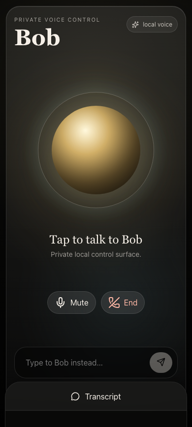
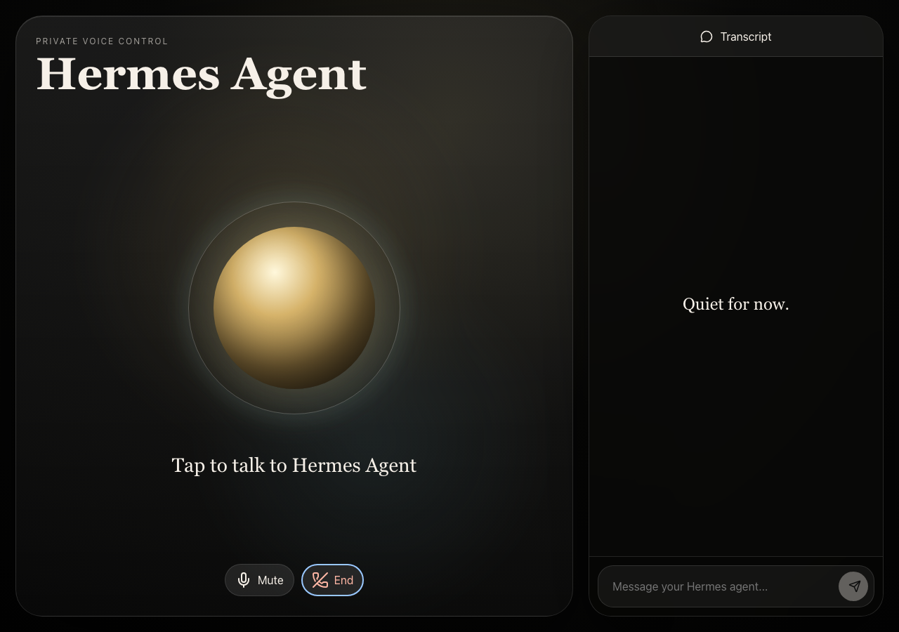

# Hermes Voice Control

Hermes Voice Control is a private-by-default browser voice surface for talking
to your Hermes agent from a phone or laptop.

The app keeps the experience simple: open the page, tap the orb, talk
naturally, interrupt by holding the orb, and keep a transcript open without
ending the conversation. The visible agent name is configurable, so each setup
can use the name of its own Hermes agent.

<p align="center">
  
</p>

<p align="center">
  
</p>

## What It Does

- Mobile-first voice UI centered on a single agent orb.
- Hands-free conversation, hold-to-talk, mute, end, and barge-in gestures.
- Text fallback for moments when voice is not right.
- Persistent transcript drawer for conversation state and recovery.
- Backend-issued Gemini Live ephemeral tokens so long-lived API keys never reach
  the browser.
- Allowlisted Hermes-agent tool calls with read-only confirmation records for
  risky work.
- Mock adapters by default so local development does not spend API quota or
  mutate local systems.

## How It Works

```text
Browser voice UI
  -> FastAPI auth/access layer
  -> Gemini ephemeral token broker
  -> Gemini Live websocket session in the browser
  -> allowlisted backend tool calls
  -> Hermes agent adapter
  -> speakable answer or recorded confirmation proposal
```

The browser is intentionally untrusted. It can request short-lived Gemini Live
tokens and call a narrow backend tool surface, but it never receives the
long-lived Gemini API key or direct access to local tools.

## Tech Stack

- **Frontend:** React, TypeScript, Vite, Vitest.
- **Audio:** Web Audio API worklets for capture, resampling, and PCM playback.
- **Realtime model path:** Gemini Live websocket protocol.
- **Backend:** FastAPI, Pydantic, SQLite, uv.
- **Tool boundary:** allowlisted agent-answer tool calls, read-only confirmation
  records, and cancellable tool calls.
- **Private network posture:** localhost first, Tailscale Serve compatible, PIN
  sessions available for remote/private-network exposure.
- **Verification:** Vitest, pytest, Playwright responsive smoke scripts, and a
  real Gemini Live smoke script.

## Security Posture

Hermes Voice Control is designed for private use before public exposure:

- Backend binds to `127.0.0.1` by default.
- No long-lived Gemini/Google API key is bundled into frontend code.
- Mock Gemini and mock Hermes adapters are the default.
- `HVC_REQUIRE_PIN=true` enables server-side PIN/session auth.
- No-PIN mode is intended for direct localhost development only.
- Unknown tools are denied.
- Agent-answer tool calls are read-only by default.
- Action-like requests can become confirmation records; approval records intent
  only and does not execute external actions in v1.

## Quick Start

Requirements:

- Node.js 22+
- pnpm 10+
- Python 3.11+
- uv

```bash
git clone https://github.com/elijahmuraoka/hermes-voice-control.git
cd hermes-voice-control
pnpm install

cd apps/server
uv venv
uv pip install -e '.[dev]'
cd ../..
```

Run the test/build checks:

```bash
pnpm env:check
pnpm verify
```

This mock-mode path is the public fresh-checkout gate. It should not require a
Gemini key, local Hermes binary, Tailscale account, `.env` file, or private
machine context.

## Local Development

Start the backend and web app together:

```bash
pnpm dev
```

Or start each process separately:

```bash
pnpm dev:server
pnpm dev:web
```

Open `http://127.0.0.1:5173`.

To customize the assistant name, set it for both the backend adapter prompt and
the frontend build:

```bash
HVC_AGENT_NAME="My Hermes Agent"
VITE_HVC_AGENT_NAME="My Hermes Agent"
```

Use any name that makes sense for your Hermes agent.

## Real Gemini Live Mode

Mock mode verifies the local UI, token broker, and backend shape. Real Gemini
Live requires a Gemini API key in the backend environment:

```bash
HVC_GEMINI_MODE=real
HVC_GEMINI_MODEL=gemini-2.5-flash-native-audio-latest
GEMINI_API_KEY=...
```

Then start the backend and web app as above.

## Local Diagnostics

Realtime latency diagnostics stay in browser memory by default. Open devtools on
the HVC page and run `window.__HVC_DIAGNOSTICS__.snapshot()` for the current
redacted bundle, or `window.__HVC_DIAGNOSTICS__.copyText()` for copyable JSON.

The bundle includes local timestamps for microphone start, first provider
response, first audio playback, tool-call request/response, cancellation, and
session close. It omits tokens, session IDs, tool arguments, response bodies,
cookies, PINs, and authorization headers.

See [Diagnostics](docs/context/diagnostics.md) for launch budgets and provider
bakeoff reuse.

## Optional Local Hermes Agent Adapter

The default Hermes agent adapter is mock. To connect a local Hermes-compatible
CLI or agent wrapper, set:

```bash
HVC_HERMES_ADAPTER=local
HVC_HERMES_BIN=/absolute/path/to/hermes
```

The local adapter invokes `hermes chat -Q -q <prompt> --toolsets safe`, treats
the prompt as read-only, and surfaces timeout/cancellation/launch errors
without hanging the browser session.

## Production Controls

These defaults are intentionally conservative:

```bash
HVC_REQUIRE_PIN=true
HVC_PIN=<at-least-8-chars-not-common>
HVC_SECURE_COOKIES=true
HVC_ALLOW_LOGS_ENDPOINT=false
HVC_AUDIT_LOG_RETENTION_DAYS=30
HVC_AUDIT_LOG_MAX_ROWS=5000
```

Keep the backend bound to `127.0.0.1` and expose it through a private reverse
proxy such as Tailscale Serve. Do not use Tailscale Funnel or a public bind
without a separate security review.

For the supported one-origin private runner:

```bash
umask 077
mkdir -p .private/rehearsal
if [ -t 0 ]; then
  printf "HVC PIN: "
  stty -echo
  IFS= read -r HVC_PIN
  stty echo
  printf "\n"
else
  IFS= read -r HVC_PIN
fi
printf "%s\n" "$HVC_PIN" > .private/rehearsal/hvc-pin.txt

HVC_PIN_FILE=.private/rehearsal/hvc-pin.txt pnpm private:tailscale -- --serve
```

This serves the built UI and API from the same private HTTPS origin, keeps the
backend on localhost, requires PIN auth, snapshots the previous Tailscale Serve
status, refuses to overwrite an incompatible Serve config, and leaves
Funnel/public exposure off. The runner also refuses `--smoke --serve`; smoke
runs verify the local backend/proxy only and never mutate Tailscale Serve. It
also refuses `--no-build --serve` so private deployments always rebuild the web
app with a same-origin API base. The runner requires an explicit mode:
`--smoke` for a bounded check, `--local` for a long-lived localhost-only soak,
or `--serve` for the private Tailscale deployment. Non-serve modes print the
localhost URL and refuse to start when the selected proxy port is already
referenced by Tailscale Serve, or when stale Serve state references the selected
backend port, preventing accidental exposure through stale Serve state. If
`--serve` configures a previously empty Serve state and post-config verification
fails, the runner resets Serve automatically before exiting.
Use the printed `localhost` URL for local browser testing; the services still
bind to `127.0.0.1`, but secure cookies are not consistently accepted by
browsers on plain-HTTP `127.0.0.1` origins.

See the [private-network runbook](docs/context/runbooks/private-network.md) for
Tailscale Serve setup, mode-specific environment checks, and failure modes.
Before tagging or publishing a public release, run the
[open-source boundary checklist](docs/context/open-source-boundary.md).

## Always-On Private Runner

For a Mac mini that should keep HVC running after login or restart, use the
tracked launchd wrapper. It stores secrets in an ignored env file and renders a
LaunchDaemon plist that references only paths:

```bash
umask 077
mkdir -p .private/deployment
openssl rand -hex 16 > .private/deployment/hvc-pin.txt
chmod 600 .private/deployment/hvc-pin.txt

cat > .private/deployment/launchd.env <<'EOF'
HVC_PIN_FILE=.private/deployment/hvc-pin.txt
HVC_GEMINI_MODE=real
GEMINI_API_KEY=<redacted>
HVC_HERMES_ADAPTER=local
HVC_HERMES_BIN=/opt/homebrew/bin/hermes
HVC_TAILSCALE_HOSTNAME=DEVICE.TAILNET.ts.net
EOF
chmod 600 .private/deployment/launchd.env

pnpm private:launchd -- render
sudo pnpm private:launchd -- install
```

Installing, bootstrapping, kickstarting, stopping, or uninstalling the
LaunchDaemon changes local machine state. Review the generated plist under
`.private/deployment/` first, then follow the runbook commands for the approved
operation. Use `--domain=agent` only when you explicitly want GUI-session or
auto-login scoped behavior.

## Verification Scripts

```bash
pnpm verify
pnpm smoke:browser
pnpm screenshots:update
node scripts/e2e-real-gemini-live.mjs
```

`pnpm smoke:browser` starts the web app, runs responsive Playwright checks, and
skips the real backend token-flow test unless `HVC_E2E_RUN_TOKEN_FLOW=true` is
set. `pnpm screenshots:update` rewrites README screenshot assets from the same
browser smoke path. The real Gemini script expects the backend to be running with
`HVC_GEMINI_MODE=real`.

## Docs

Start with:

- [Vision](docs/VISION.md)
- [Architecture](docs/ARCHITECTURE.md)
- [Implementation notes](docs/context/implementation-notes.md)
- [Open-source voice systems research](docs/context/research/open-source-voice-systems.md)
- [Realtime provider bakeoff](docs/context/research/realtime-provider-bakeoff.md)
