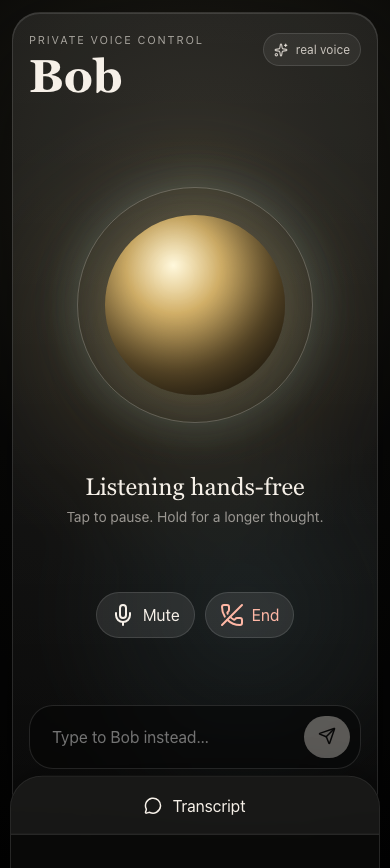

# Hermes Voice Control

Hermes Voice Control is a private-by-default browser voice surface for talking
to Bob from a phone or laptop.

Bob is the named assistant/persona this app is built around. The app keeps that
experience simple: open the page, tap the orb, talk naturally, interrupt by
holding the orb, and keep a transcript open without ending the conversation.

<p align="center">
  
  
</p>

<p align="center">
  
</p>

## What It Does

- Mobile-first voice UI centered on a single Bob orb.
- Hands-free conversation, hold-to-talk, mute, end, and barge-in gestures.
- Text fallback for moments when voice is not right.
- Persistent transcript drawer for conversation state and recovery.
- Backend-issued Gemini Live ephemeral tokens so long-lived API keys never reach
  the browser.
- Allowlisted Bob/Hermes tool calls with confirmation records for risky work.
- Mock adapters by default so local development does not spend API quota or
  mutate local systems.

## How It Works

```text
Browser voice UI
  -> FastAPI auth/access layer
  -> Gemini ephemeral token broker
  -> Gemini Live websocket session in the browser
  -> allowlisted backend tool calls
  -> Bob/Hermes adapter
  -> speakable answer or confirmation proposal
```

The browser is intentionally untrusted. It can request short-lived Gemini Live
tokens and call a narrow backend tool surface, but it never receives the
long-lived Gemini API key or direct access to local tools.

## Tech Stack

- **Frontend:** React, TypeScript, Vite, Vitest.
- **Audio:** Web Audio API worklets for capture, resampling, and PCM playback.
- **Realtime model path:** Gemini Live websocket protocol.
- **Backend:** FastAPI, Pydantic, SQLite, uv.
- **Tool boundary:** allowlisted `ask_bob`, confirmation proposal records, and
  cancellable tool calls.
- **Private network posture:** localhost first, Tailscale Serve compatible, PIN
  sessions available for remote/private-network exposure.
- **Verification:** Vitest, pytest, Playwright responsive smoke scripts, and a
  real Gemini Live smoke script.

## Security Posture

Hermes Voice Control is designed for private use before public exposure:

- Backend binds to `127.0.0.1` by default.
- No long-lived Gemini/Google API key is bundled into frontend code.
- Mock Gemini and mock Hermes adapters are the default.
- `HVC_REQUIRE_PIN=true` enables server-side PIN/session auth.
- No-PIN mode is intended for direct localhost development only.
- Unknown tools are denied.
- `ask_bob` is answer/read-only by default.
- Action-like requests should become confirmation records; approval does not
  execute external actions in the current implementation.

## Quick Start

Requirements:

- Node.js 22+
- pnpm 10+
- Python 3.14+
- uv

```bash
git clone https://github.com/elijahmuraoka/hermes-voice-control.git
cd hermes-voice-control
pnpm install

cd apps/server
uv venv
uv pip install -e '.[dev]'
cd ../..
```

Run the test/build checks:

```bash
pnpm test
pnpm build
```

## Local Development

Start the backend in mock mode:

```bash
cd apps/server
HVC_GEMINI_MODE=mock uv run uvicorn app.main:app --host 127.0.0.1 --port 8765
```

Start the web app:

```bash
pnpm --filter @hvc/web dev --host 127.0.0.1 --port 5173
```

Open `http://127.0.0.1:5173`.

## Real Gemini Live Mode

Mock mode verifies the local UI, token broker, and backend shape. Real Gemini
Live requires a Gemini API key in the backend environment:

```bash
HVC_GEMINI_MODE=real
GEMINI_API_KEY=...
```

Then start the backend and web app as above.

## Optional Local Hermes Adapter

The default Hermes adapter is mock. To connect a local Hermes-compatible CLI,
set:

```bash
HVC_HERMES_ADAPTER=local
HVC_HERMES_BIN=/absolute/path/to/hermes
```

The local adapter invokes `hermes chat -q <prompt> --toolsets safe`, treats the
prompt as read-only, and surfaces timeout/cancellation/launch errors without
hanging the browser session.

## Verification Scripts

```bash
pnpm exec playwright test scripts/browser-responsive.spec.ts --reporter=list
node scripts/e2e-real-gemini-live.mjs
```

The Playwright script expects the web app to be running. The real Gemini script
expects the backend to be running with `HVC_GEMINI_MODE=real`.

## Docs

Start with:

- [Vision](docs/VISION.md)
- [Architecture](docs/ARCHITECTURE.md)
- [Implementation notes](docs/context/implementation-notes.md)
- [Open-source voice systems research](docs/context/research/open-source-voice-systems.md)
