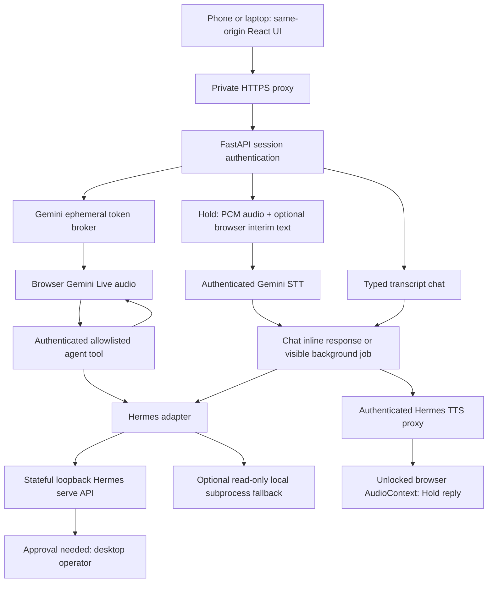

# Architecture

## Runtime Path

The default private deployment uses Tailscale Serve for HTTPS and a loopback
proxy serving both the built UI and API paths. Production API URLs are
same-origin: a phone's localhost is never the agent host. This describes source
at `c7c501f`, not a freshly checked live deployment.

Live mode treats Gemini as the realtime audio transport, not the source of
agent answers. The browser sends a session instruction that requires
user-facing answers to go through the allowlisted `ask_agent` tool, and it
suppresses model audio/text until a backend tool response has unlocked the turn.
This keeps Live voice aligned with the same Hermes adapter path used by typed
chat and Basic Hold.

## Components

- `apps/web`: React voice UI, orb state machine, audio worklets, realtime
  provider boundary, Gemini Live protocol wrapper, default basic hold-to-talk
  audio capture with browser interim text, local diagnostics recorder,
  transcript drawer, and text fallback.
- `apps/server`: FastAPI auth/session layer, Gemini token broker, tool allowlist,
  Gemini STT and Hermes TTS endpoints, SQLite chat-job/session storage,
  confirmation records, readiness/log controls, and Hermes adapters.
- `scripts/browser-responsive.spec.ts`: Playwright responsive/browser smoke with
  fake microphone permission and screenshot capture.
- `scripts/e2e-real-gemini-live.mjs`: credentialed Gemini Live smoke that mints
  a backend token, sends generated speech PCM, terminates with
  `audioStreamEnd`, and waits for Gemini output.

## Trust Boundaries

The browser never receives long-lived Gemini/Google API keys, Hermes state, or
direct local-tool access. It receives backend-issued Gemini ephemeral tokens and
can ask the backend to run only allowlisted HVC tools.

Basic hold-to-talk records audio only while the operator holds the orb. Browser
speech recognition provides optional interim text and fallback; it is not
required when server STT is usable (including standalone iOS/Firefox). The
authenticated STT path finalizes the transcript before it enters the same chat
job lifecycle as typed messages. Gemini STT sends audio to Google's cloud API,
not merely to a private local recognizer. Hold capture is bounded to roughly
60 seconds, with visible disclosure/cap feedback. Audio is not persisted to
disk by HVC.

Hold answers remain visible in the transcript and use `/tts` to call the
existing Hermes `/api/audio/speak` endpoint with server-only credentials. This
reuses the agent's configured TTS provider; it does not manufacture a new
Gemini voice. Playback uses an already-unlocked AudioContext, supports
barge-in, and has browser speech synthesis as a last-resort fallback. Live
retains its separate Gemini audio path and configured voice.

No-PIN mode is a localhost development convenience. Remote/proxied access
without a PIN is blocked unless `HVC_ALLOW_NO_PIN_REMOTE=true` is set
intentionally. Tailscale Serve should run with `HVC_REQUIRE_PIN=true`.

Tool calls are cancellable. Barge-in or end-session cancellation asks the
backend to mark the tool call cancelled, aborts the frontend request, and causes
late responses for that call to be ignored.

## PWA and Resilience Features

- **Installable PWA:** The app ships a web manifest with `display: standalone`.
  Supported browsers can add HVC to the home screen or app launcher. The
  installed name is fixed at build time: "Hermes Voice Control" (short name
  "Hermes"). The in-app agent name is separately configurable via
  `VITE_HVC_AGENT_NAME`.
- **Live self-healing reconnect:** When the Gemini Live WebSocket drops, the
  client reconnects automatically — it re-mints a fresh ephemeral token from the
  backend, re-establishes the WebSocket, and applies bounded backoff. Healthy
  sessions are not replaced simply because a tab becomes visible again;
  suspended audio is resumed first. Wake locks are feature-detected and held
  only during active voice/capture. Recovery cannot guarantee continuity after
  an OS terminates the app.
- **Unlock-time Hermes session warming:** When the operator unlocks the app
  (PIN entry or device-cookie auth), the backend immediately warms the Hermes
  session so the first agent answer is pre-warmed and lower-latency.

## Data Stores

SQLite stores sessions, transcripts/events, confirmations, audit logs, and
tool-call cancellation markers, plus chat-job results and stored Hermes session
IDs. When remembered-device auth is enabled, the agent principal uses the
hashed device identity; ordinary session-cookie renewal does not itself reset
that identity. Without remembered-device auth, the session principal can
change on re-authentication. The browser also caches its transcript locally;
this is not the canonical Hermes memory.

Chat requests use a 750 ms default inline budget and fall back to visible,
pollable, cancellable jobs with partial text when work takes longer. Persisted
job metadata does not imply restartable in-flight agent execution after an
HVC process crash. The API adapter consumes streamed agent events and supports
resume/interrupt; the local fallback is a separate one-shot CLI path. Hermes
approval events become a permission-needed state requiring desktop action;
HVC confirmation records do not execute actions themselves.

`/healthz` is a basic liveness endpoint. `/readyz` reports a minimal pass/fail
result without public adapter diagnostics. Authenticated `/readyz/details`
contains readiness checks, adapter/STT configuration, and TTS availability.
Availability configuration is not proof of successful agent/TTS execution.
An expired session must re-authenticate; missing details must not show the agent
as reachable. `/logs` is
disabled by default and requires `HVC_ALLOW_LOGS_ENDPOINT=true`. Audit logs are
pruned at startup with `HVC_AUDIT_LOG_RETENTION_DAYS` and
`HVC_AUDIT_LOG_MAX_ROWS`.

## Context Documents

- [Security model](context/security-model.md)
- [Private network runbook](context/runbooks/private-network.md)
- [Tailscale private exposure](context/tailscale-private-exposure.md)
- [Hermes integration](context/hermes-integration.md)
- [Realtime provider boundary](context/realtime-provider-boundary.md)
- [UX state machine](context/ux-state-machine.md)
- [Diagnostics](context/diagnostics.md)
- [Implementation notes](context/implementation-notes.md)
- [Open-source boundary](context/open-source-boundary.md)
- [Open-source voice systems research](context/research/open-source-voice-systems.md)
- [Realtime provider bakeoff](context/research/realtime-provider-bakeoff.md)

## Current Work

The [project handoff](context/project-handoff.md) records the upstream-first
maintenance direction and complete implementation references. The older
[hardening/live-verification bundle](specs/active/2026-06-07-hvc-hardening-live-verification/SPEC.md)
remains a historical unfinished verification record. The archived July bundle
is not proof that phone or reboot acceptance passed.
